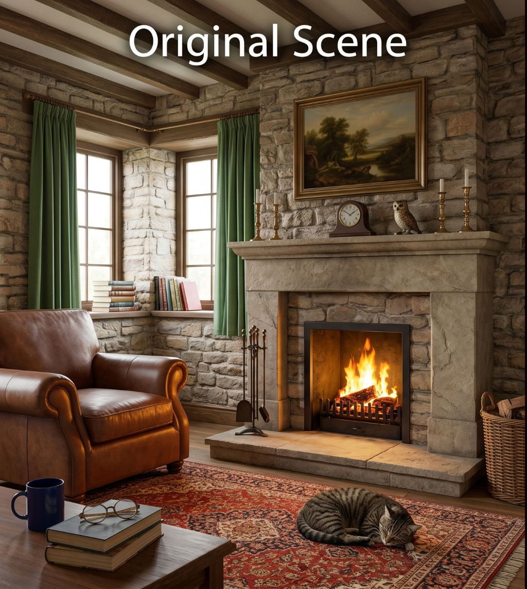
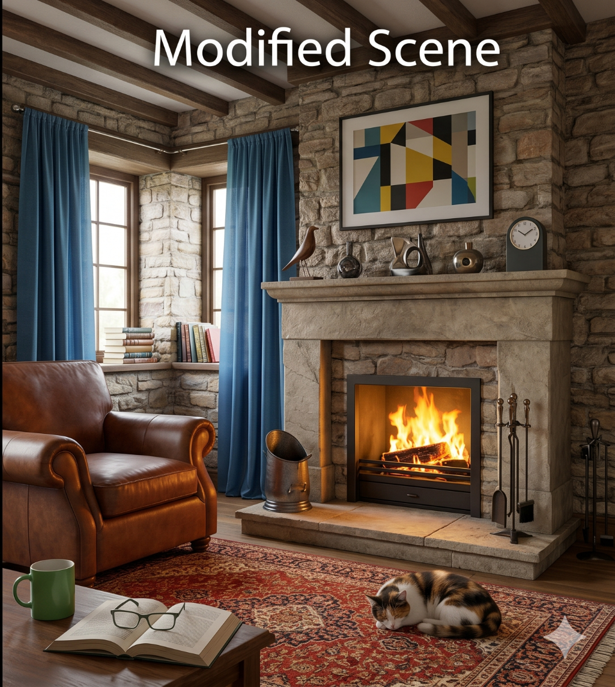

# Image Differences Analysis

## Scope

Comparison between the original scene and the modified scene from the ESA Gaming QA Engineer task PDF.

## Reference Images

| Original scene                               | Modified scene                               |
| -------------------------------------------- | -------------------------------------------- |
|  |  |

## Summary

Total visible differences found: 20

## Section 1: Window

| ID  | Original scene                                                        | Modified scene                                                       | Difference                            |
| --- | --------------------------------------------------------------------- | -------------------------------------------------------------------- | ------------------------------------- |
| 1   | The curtains are green.                                               | The curtains are blue.                                               | The curtain color is different.       |
| 2   | The curtains end a little below the window sill.                      | The curtains reach the floor.                                        | The curtain length is different.      |
| 3   | The curtain on the right window is fully gathered to the side.        | The curtain on the right window covers about half of the window.     | The curtain position is different.    |
| 4   | The curtain rail is copper-colored.                                   | The curtain rail is silver-colored.                                  | The curtain rail color is different.  |
| 5   | The curtain rail on the left window has the same length as its frame. | The curtain rail on the left window extends a little past the frame. | The curtain rail length is different. |

## Section 2: Table

| ID  | Original scene                                                           | Modified scene                                           | Difference                                 |
| --- | ------------------------------------------------------------------------ | -------------------------------------------------------- | ------------------------------------------ |
| 6   | The mug is dark blue on the outside and inside.                          | The mug is green on the outside and white on the inside. | The mug color is different.                |
| 7   | There are two books on the table.                                        | There is one book on the table.                          | The number of books is different.          |
| 8   | The books are placed one on top of the other, and both books are closed. | There is one open book on the table.                     | The book position and state are different. |
| 9   | The glasses have a round frame and are folded.                           | The glasses have a square frame and are unfolded.        | The glasses shape and state are different. |
| 10  | The glasses are placed on the closed books.                              | The glasses are placed on the open book.                 | The glasses position is different.         |

## Section 3: Floor

| ID  | Original scene                                                      | Modified scene                                                             | Difference                                  |
| --- | ------------------------------------------------------------------- | -------------------------------------------------------------------------- | ------------------------------------------- |
| 11  | The cat is gray with stripes.                                       | The cat has white, yellow, and gray colors.                                | The cat color is different.                 |
| 12  | The cat is facing away from the armchair.                           | The cat is facing toward the armchair.                                     | The cats are facing in opposite directions. |
| 13  | A wicker basket is on the floor on the right side of the fireplace. | Metal fireplace tools are on the floor on the right side of the fireplace. | The object on the floor is different.       |

## Section 4: Fireplace

| ID  | Original scene                                                                                         | Modified scene                                                                                    | Difference                                                        |
| --- | ------------------------------------------------------------------------------------------------------ | ------------------------------------------------------------------------------------------------- | ----------------------------------------------------------------- |
| 14  | The fireplace screen has vertical bars.                                                                | The fireplace screen has two horizontal bars.                                                     | The fireplace screen design is different.                         |
| 15  | Metal fireplace tools are on the left side of the fireplace floor.                                     | An oval metal object is on the left side of the fireplace floor.                                  | The object on the left side of the fireplace floor is different.  |
| 16  | There is nothing on the right side of the fireplace floor.                                             | Metal fireplace tools are on the right side of the fireplace floor.                               | A new object is present on the right side of the fireplace floor. |
| 17  | There are six objects on the mantel.                                                                   | There are five objects on the mantel.                                                             | The number of objects on the mantel is different.                 |
| 18  | From left to right, the mantel has two candle holders, a clock, an owl figure, and two candle holders. | From left to right, the mantel has a bird figure, a vase, an unknown object, a vase, and a clock. | The object types and order on the mantel are different.           |

## Section 5: Painting

| ID  | Original scene                               | Modified scene                        | Difference                         |
| --- | -------------------------------------------- | ------------------------------------- | ---------------------------------- |
| 19  | The painting shows a landscape.              | The painting shows an abstract image. | The painting content is different. |
| 20  | The painting has a thick gold-colored frame. | The painting has a thin black frame.  | The painting frame is different.   |

## Conclusion

A total of 20 visible differences were identified between the original and modified scenes. The differences were documented by section to provide a clear and structured comparison.
